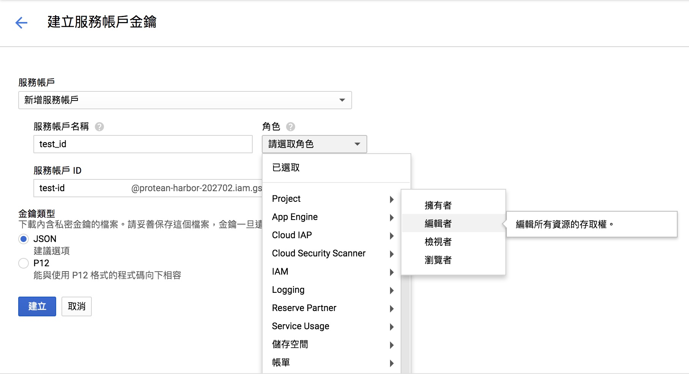
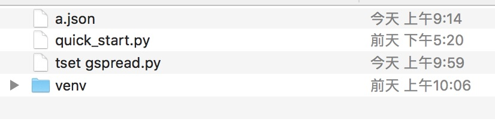
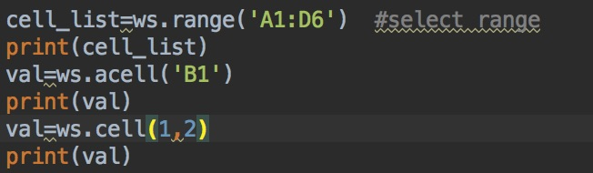
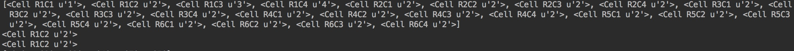
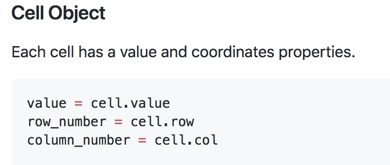

# gspread: 
### 開啟權限：
#### Step 1.
		
	開啟terminal 安裝套件
	#pip install gspread			
	#pip install oauth2client	


#### Step2.打開連結，搜尋Google Drive API與Google Sheets API並啟用 
### [Open Link ](https://console.developers.google.com/apis/)


#### Step3.到憑證頁面新增一個’服務帳戶金鑰’



#### Step4.建立之後把輸出的Json檔放入執行python同一個目錄下


---
## 程式部分：
#### header
	
```python 
	#-*- coding:utf-8 -*-

	import gspread   #pip install gspread
	from oauth2client.service_account import ServiceAccountCredentials   #pip install --upgrade oauth2client

	scope = ['https://spreadsheets.google.com/feeds','https://www.googleapis.com/auth/drive']
	CLIENT_SECRET_FILE = 'a.json'   #file of Key,same dir

	credentials = ServiceAccountCredentials.from_json_keyfile_name(CLIENT_SECRET_FILE,scope)

	gs = gspread.authorize(credentials)
```

### 開啟專案(spreadsheet)方式：
```python
gsheet = gs.open_by_key ('1n0Gd9RPVqQBYSZ_jgoHIcuR5J5uO88Fd7SeOUVv_f_I')   
		#open by spreadsheet's ID
	
	gsheet = gs.open ('111')  
		#open by spreadsheet's title
```
### Create與Delete worksheet方式：
```python
worksheet = gs.add_worksheet(title="A worksheet", rows="100", cols="20")

	gs.del_worksheet(worksheet)
```
### 選擇worksheet方式:
```python

	ws=gsheet.get_worksheet(2)            
		#get worksheet by index.               
			#p.s : start at index 0

	ws=gsheet.worksheet("January")        
		#get worksheet by worksheet's title

	worksheet_list = gsheet.worksheets()  
		#get the list of all worksheet
```
### 選擇一格或者是一個範圍：
```python
	cell_list=ws.range('A1:D6')  		  #select range,資料型態為list
	cell = ws.acell('B1')				  #get B1's value
	cell = ws.cell(1, 2)   				  #get row 1 	coluem 2 (B1) value
```


### CELL的資料型態包含


### 取得範圍或者一格的Value：
```python
	val = ws.acell('B1').value  			#get B1's value
	val = ws.cell(1, 2).value   			#get row 1 coluem 2 (B1) value
	values_list = ws.row_values(1)  		#get list of 	value by row (p.s:start at 1)
	values_list = ws.col_values(3)  		#get list of 	value by column (p.s:start at 1)
	list_of_lists = ws.get_all_values()     #get list of list of value 
```
### 設定一格或者範圍Value：
```python
	ws.update_acell('B1', 'Bingo!')		#update value of a cell
	#Or
	ws.update_cell(1, 2, 'Bingo!')		#與上一個指令的動作一樣

	cell_list = ws.range('A1:C7')		#select range 
	for cell in cell_list:
	   cell.value = 'O_o'				#change value
	ws.update_cells(cell_list)			#update value 
```
###透過值來尋找Cell(可以配合re使用)：
```python
	cell = worksheet.find("Dough")   #get the cell 
	cell_list = worksheet.findall("Rug store")   #get list of cell 
```